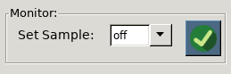
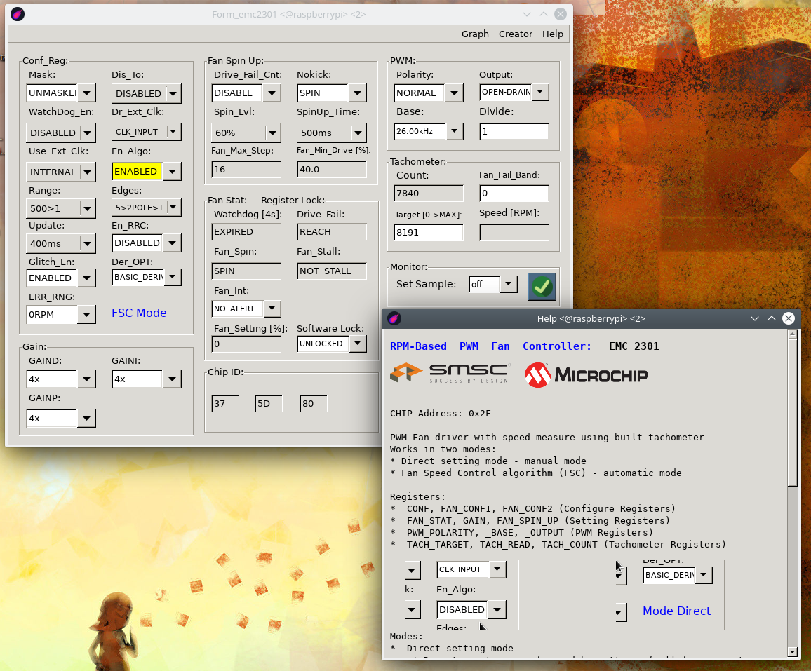
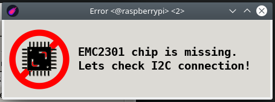

# emc2301_IIC module

**Last modification:** 6.03.2021

**Modul board:**
-  **!NEW!** Currently in development process

**Reconnection with Raspberry PI 3+:**

* Configuration for /dev/i2c-1
* port 2 (SDA), port 3 (SCL)
* pull-up resistor for this module was set to 2.2 k&#937;

### How to install? ###
Install Lazarus-ide at raspberry [FPC & Lazarus Installation](../lazarus.md)
Install Python3 and next modules for hdc1080 [Python3 & modules](ecomet_i2c_sensors/hdc1080/hdc1080_python_IIC.md)

(optional when you have only lite linux version)
```console
sudo apt-get install gtk2-engines libgtk2.0-dev
```

### Run application: ###
```console
ecomet_i2c_raspberry_tools/emc2301
```

**Features:**

* Set fan control in 2 modes: 
  * Direct Setting Mode - Manual setting of fan parameters, speed and measure by tachometer
  * FSC Mode (Fan Speed Controll Mode) - Automatic setting target speed a feed back speed control by in-build tachometer
* Setting Software Lock Register for store of settings of status the some  chip registers  Unlock only after power off chip.
* Update data from registers:
  * Toogle the button: 
  
  * Setting auto update 
    * possible time update [off,1s,3s,5s,10s,20s]
* Application GUI could run independently under chip control. You could run GUI and in other termina run test scripts working with chip.
  * Setting automatical update at Monitor Window you could monitor current fan speed or other changes.
* ID of the chip (ID Window)
* Conf Reg Window:
  * Seting fan parameters, clock input, watchdog, set mode
* Gain Window ony in (FSC Mode):
  * The  Gain  register  stores  the  gain  terms  used  by  the  proportional  and  integral  portions  of  the  RPM
* Spin Up Window:
  * Setting Spin, slope of the running curve during speed change
* Fan Stat Window (Reading):
  * See current status of fan [Stall, WatchDog, Drive_Fail, Reaching Spin]
  * Setting ALARM interupt on/off
  * Software Lock for selected Registers
* PWM Window:
  * Setting parameters of PWM [frequency, signal inversion, pwm output]
* Tachometer Window:
  * Read or Write Tachometer parameters
* Monitor Window:
 * Setting time offest for reading chip registers
 * Could be used for automatick update or manual
 
TABS:
~ Graph: Currently not developed, just init preparation
~ Help: Short help for GUI
~ Creator: Creator information

Limitations:
~ Graph feature currently not developed
**Application pictures:**



When EMC2301 Chip is not responding at I2C lines you see:



**Source Code (FPC):**
* Path: ~/ecomet_i2c_raspberry_tools/fpc/emc2301

**Test python scripts**
* Path: !/ecomet_i2c_raspberry_tools/python_test_scripts

scripts copy to /ecomet_i2c_raspberry_tools path and then run
