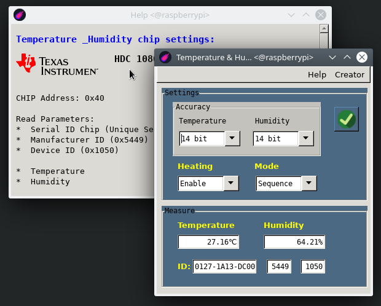
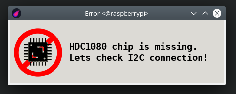

# hdc1080_IIC module

**Last modification:** 6.08.2020

**Modul board:**
[ebay](https://www.ebay.com/itm/HDC1080-module-Low-Power-Temperature-with-Sensor-Humidity-Digital-Accuracy-High/143492459090?ssPageName=STRK%3AMEBIDX%3AIT&_trksid=p2057872.m2749.l2649)
I ordered and tested this modul board

**Reconnection with Raspberry PI 3+:**

* Configuration for /dev/i2c-1
* port 2 (SDA), port 3 (SCL)
* pull-up resistor for this module was set to 1.5 k&#937;

### How to install? ###

Install Lazarus-ide at raspberry [FPC & Lazarus Installation](../lazarus.md)
Install Python3 and next modules for hdc1080 [Python3 & modules](../../i2c_pkg/hdc1080_pkg/hdc1080_python_IIC.md)

(optional when you have only lite linux version)
```console
sudo apt-get install gtk2-engines libgtk2.0-dev
```

### Run application: ###
```console
ecomet_i2c_tools/hdc1080
```

**Features:**

*  Read config and measure register of hdc1080 chip and show on concole
*  In Accuracy section is possible to set accuracy of measurment for Temperature and Humidity setting of A/D converter
*  Heating means (ENABLE/DISABLE) heating chip before measurement
*  Chip (MODE) means if measurement will be done by reading temperature and humidity in one cycle or separately:
   *  Mode Both for measurement in on cycle
   *  Mode Sequence when each measurement is done individualy
*  ID is only readable parameter:
   *  First number (ID Serial) Unique serial number of chip
   *  Second number (Manufacturer ID)
   *  Device Type ID
*  Help for quick help
*  Self test for I2C connection
*  Pushing  will be refreshed measurement and read changes of chip setting

**Application pictures:**



Prepare for measurement



Chip I2C Issue


**Source Code (FPC):**
* Path: ~/ecomet_i2c_tools/fpc/hdc1080
