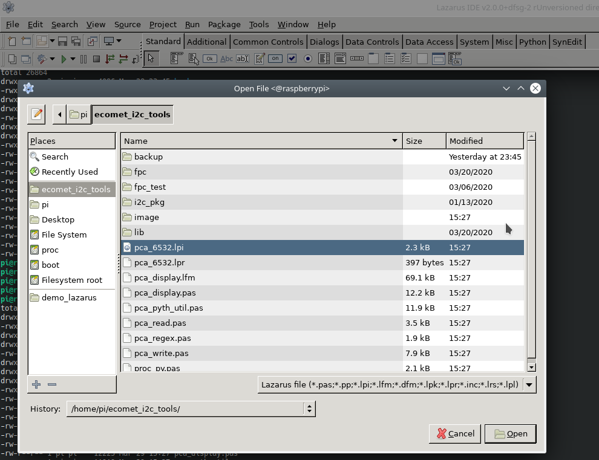

# Lazarus Installation #

**Last update:** 29.03.2020
Author: Marian Minar

**Insalled at Raspberry PI 3+:**

### How to install? ###
```console
sudo apt-get install lazarus-ide
sudo apt-get install fpc lazarus
```

check installed software

``` console
$ apt search lazarus | grep installed

fpc-source-3.0.4/stable,now 3.0.4+dfsg-22+rpi1 all [installed,automatic]
lazarus/stable,now 2.0.0+dfsg-2 all [installed]
lazarus-2.0/stable,now 2.0.0+dfsg-2 all [installed,automatic]
lazarus-doc-2.0/stable,now 2.0.0+dfsg-2 all [installed,automatic]
lazarus-ide/stable,now 2.0.0+dfsg-2 all [installed]
lazarus-ide-2.0/stable,now 2.0.0+dfsg-2 armhf [installed,automatic]
lazarus-ide-gtk2-2.0/stable,now 2.0.0+dfsg-2 armhf [installed,automatic]
lazarus-src-2.0/stable,now 2.0.0+dfsg-2 all [installed,automatic]
lcl-2.0/stable,now 2.0.0+dfsg-2 armhf [installed,automatic]
lcl-gtk2-2.0/stable,now 2.0.0+dfsg-2 armhf [installed,automatic]
lcl-nogui-2.0/stable,now 2.0.0+dfsg-2 armhf [installed,automatic]
lcl-units-2.0/stable,now 2.0.0+dfsg-2 armhf [installed,automatic]
lcl-utils-2.0/stable,now 2.0.0+dfsg-2 armhf [installed,automatic]

$ apt search fp | grep installed

fp-compiler/stable,now 3.0.4+dfsg-22+rpi1 armhf [installed,automatic]
fp-compiler-3.0.4/stable,now 3.0.4+dfsg-22+rpi1 armhf [installed,automatic]
fp-docs-3.0.4/stable,now 3.0.4+dfsg-22+rpi1 all [installed,automatic]
fp-ide-3.0.4/stable,now 3.0.4+dfsg-22+rpi1 armhf [installed,automatic]
fp-units-base-3.0.4/stable,now 3.0.4+dfsg-22+rpi1 armhf [installed,automatic]
fp-units-db-3.0.4/stable,now 3.0.4+dfsg-22+rpi1 armhf [installed,automatic]
fp-units-fcl-3.0.4/stable,now 3.0.4+dfsg-22+rpi1 armhf [installed,automatic]
fp-units-fv-3.0.4/stable,now 3.0.4+dfsg-22+rpi1 armhf [installed,automatic]
fp-units-gfx-3.0.4/stable,now 3.0.4+dfsg-22+rpi1 armhf [installed,automatic]
fp-units-gtk2-3.0.4/stable,now 3.0.4+dfsg-22+rpi1 armhf [installed,automatic]
fp-units-math-3.0.4/stable,now 3.0.4+dfsg-22+rpi1 armhf [installed,automatic]
fp-units-misc-3.0.4/stable,now 3.0.4+dfsg-22+rpi1 armhf [installed,automatic]
fp-units-multimedia-3.0.4/stable,now 3.0.4+dfsg-22+rpi1 armhf [installed,automatic]
fp-units-net-3.0.4/stable,now 3.0.4+dfsg-22+rpi1 armhf [installed,automatic]
fp-units-rtl-3.0.4/stable,now 3.0.4+dfsg-22+rpi1 armhf [installed,automatic]
fp-utils-3.0.4/stable,now 3.0.4+dfsg-22+rpi1 armhf [installed,automatic]
fpc/stable,now 3.0.4+dfsg-22+rpi1 all [installed]
fpc-3.0.4/stable,now 3.0.4+dfsg-22+rpi1 all [installed,automatic]
fpc-source-3.0.4/stable,now 3.0.4+dfsg-22+rpi1 all [installed,automatic]

```

remote connection to raspberry:

```console
ssh -l pi -X <ip_address>
lazarus-ide
```

### Pre-requisited library for lazarus ###
compile Python-for-Lazarus libraries

* was tailored and tested for python3 at raspberry 3+
```console
3.7.3 (default, Dec 20 2019, 18:57:59) 
[GCC 8.3.0]
```

### How to compile Free Pascal code of project? ###
* copy sources to main directory

```console
pi@raspberrypi:~ $ cd ecomet_i2c_tools/
pi@raspberrypi:~/ecomet_i2c_tools $ cp -rf fpc/pca9632/* ./
pi@raspberrypi:~/ecomet_i2c_tools $ ls -l

drwxr-xr-x 3 pi pi     4096 Mar 20 23:52 fpc
-rw-r--r-- 1 pi pi      190 Dec 26 10:02 i2c_config.yaml
drwxr-xr-x 5 pi pi     4096 Jan 13 07:55 i2c_pkg
drwxr-xr-x 3 pi pi     4096 Mar 29 15:27 image
drwxr-xr-x 3 pi pi     4096 Mar 20 22:09 lib
-rwxr-xr-x 1 pi pi 27189544 Mar 29 14:11 pca_6532
-rw-r--r-- 1 pi pi     1545 Mar 28 21:43 pca_6532_i2c_test.py
-rw-r--r-- 1 pi pi     2323 Mar 29 15:27 pca_6532.lpi
-rw-r--r-- 1 pi pi      397 Mar 29 15:27 pca_6532.lpr
-rw-r--r-- 1 pi pi     9129 Mar 29 15:27 pca_6532.lps
-rw-r--r-- 1 pi pi   139052 Mar 29 15:27 pca_6532.res
-rw-r--r-- 1 pi pi    69063 Mar 29 15:27 pca_display.lfm
-rw-r--r-- 1 pi pi    12225 Mar 29 15:27 pca_display.pas
-rw-r--r-- 1 pi pi    11919 Mar 29 15:27 pca_pyth_util.pas
-rw-r--r-- 1 pi pi     3514 Mar 29 15:27 pca_read.pas
-rw-r--r-- 1 pi pi     1877 Mar 29 15:27 pca_regex.pas
-rw-r--r-- 1 pi pi     7851 Mar 29 15:27 pca_write.pas
-rw-r--r-- 1 pi pi     2118 Mar 29 15:27 proc_py.pas
```

* install Python-for-Lazarus library
* open oproject & compile it.




[Python-for-Lazarus (Alexey-T clone)](https://github.com/mamin27/Python-for-Lazarus) 