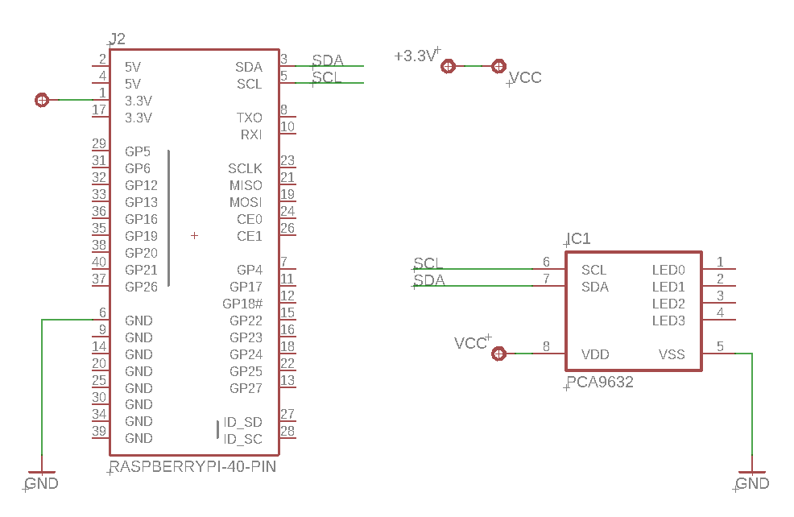
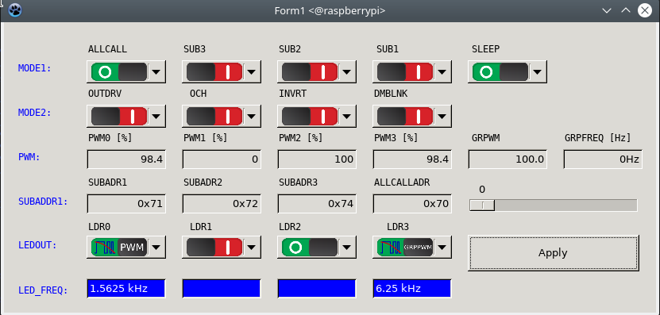

# pca9632_IIC module

**Last modification:** 29.03.2020

**Schematics of Module:**
*schematics for testing will be added later*


**Reconnection with Raspberry PI 3+:**


* schematics of PI reconnection*

* Configuration for /dev/i2c-1
* port 2 (SDA), port 3 (SCL)
* pull-up resistor is used from module board (R2,R3)

### How to install? ###

Install Lazarus-ide at raspberry [FPC & Lazarus Installation](../lazarus.md)
Install Python3 and next modules for pca9632 [Python3 & modules](../../i2c_pkg/pca9632_pkg/pca_9632_python_IIC.md)

### Run application: ###
```console
ecomet_i2c_tools/pca_6532
```

**Features:**

*  Read status of pca_6532 chip and show on concole
*  Click at Enumerated Buttons (as ALLCALL), choice from values for register (MODE1, MODE2, LEDOUT)
*  Write to Register - Actually modified value visible by red rectangular (example SLEEP button) 
*  Apply write changes for all actually selected attributes (buttons) - click at **APPLY** button
*  Click at button (with values) changed to color to white. Then able to change value - !to be done!

   **>>Sub Features:**

* Register MODE1, MODE2 enumerate ON, OFF status
* Register LEDOUT, enumerate ON, OFF, PWM, PWM_GRPPWM status

**Limitations**
 
* Register PWMx, SUBADDRx,GRPPWM, GRPFREQ only in read mode



**Source Code (FPC):**
* Path: ~/ecomet_i2c_tools/fpc/pca9632