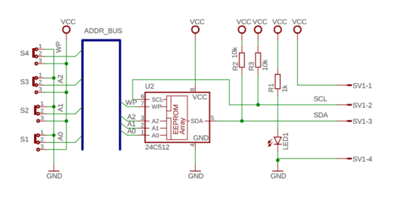
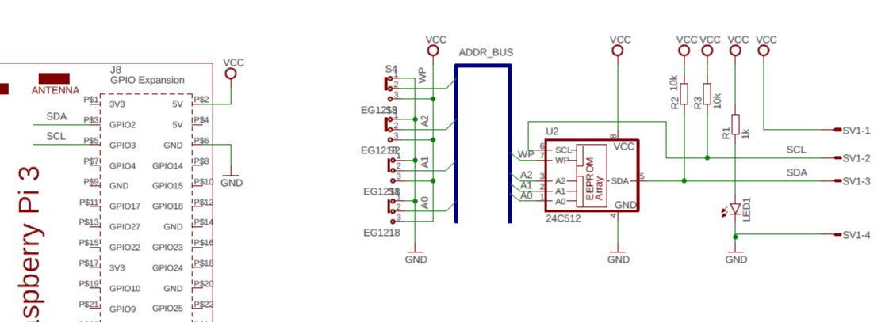

# EPROM Data Storage Module IIC I2C Interface Data Memory Module #

**Last update:**  Sunday, 29. December 2019
**Author:** Marian Minar

**Schematics of Module:**
https://pixelelectric.com/at24c256-iic-eeprom-memory-module/

**Reconnection with Raspberry PI 3+:**

* Configuration for /dev/i2c-1
* port 2 (SDA), port 3 (SCL)
* pull-up resistor is used from module board (R2,R3)

### How to install? ###
`git clone https://github.com/mamin27/ecomet_i2c_tools.git`

used modules:
RPi.GPIO,smbu2,colorama,yaml,re,randrange,os

`sudo pip3 install RPi.GPIO smbus2 colorama PyYAML`
`Looking in indexes: https://pypi.org/simple,`
`Requirement already satisfied: RPi.GPIO in /usr/lib/python3/dist-packages (0.7.0)`
`Requirement already satisfied: smbus2 in /usr/local/lib/python3.7/dist-packages (0.3.0)`
`Requirement already satisfied: colorama in /usr/lib/python3/dist-packages (0.3.7)`
`Requirement already satisfied: PyYAML in /usr/local/lib/python3.7/dist-packages (5.2)`

Check settings in config file (i2c_config.yaml)

#### Python scipt: ####>

`eeprom_mgr.py <option>`
   
`   option:`
`     -h help`
`     -p chip name`
`     -t run in test mode`
`     -wipe wipe eeprom`
`     -r read content of chip`
`     -w write into chip`
`     -f file name, used with read and write commands`
   
` <-p>,<--chip> chip name:`
`   list of these chips are usable 24C02,24C04,24C08,24C16,24C32,24C64,24C128,24C256,24C512,24C1024`
   
` <-t>|<--test> test mode:`
`   test mode will write random number into chip, read contentant and compare`
` <--wipe> wipe:`
`    wipping data at chip`
` <-r> read:`
`   read content of chip and write into file <-f>`
` <-w> write:`
`   write content from file <-f> into chip`
` Note: when file attribute is not added will be used default file name`
` <-m> file mod:`
`   file could be stored in two mods:`
`   row - row hexadecimal mode`
`   wide - explaining hexadecimal mode`

#### Usable Chips ####
Chip Name | Size  | Address Bits | Address Size | Tested?
----------------: | ------ | ------------------- | ------------------ | -------------
24c01 | 1-Kbit (128x8) | A6  - A0 | 007F
24c02 | 2-Kbit (256x8) | A7  - A0 | 00FF
24c04 | 4-Kbit (512x8) | A8  - A0 | 01FF | tested
24c08 | 8-Kbit (1024x8) | A9  - A0 | 03FF
24c16 | 16-Kbit (2048x8) | A10 - A0 | 07FF
24c32 | 32-Kbit (4096x8) | A11 - A0 | 0FFF | tested
24c64 | 64-Kbit (8192x8) | A12 - A0 | 1FFF | tested
24c128 | 128-Kbit (16384x8) | A13 - A0 | 3FFF
24c256 | 256-Kbit (32768x8) | A14 - A0 | 7FFF
24c512 | 512-Kbit (65536x8) | A15 - A0 | FFFF
24c1024 | 1024-Kbit (1048576x8) | A16 - A0 | FFFFF

#### Examples: ####
Test if eeprom chip is correct. This check write random numbers and compare them with read content. Test will pass full size of EEPROM
`sudo python3 eeprom_mng.py -p 24c32 --test`

Wipe content of EEPROM with '0xFF' data
 `sudo python3 eeprom_mng.py -p 24c32 --wipe`
 
 Read data into default file in directory data (eeprom_chip.hex)
 `sudo python3 eeprom_mng.py -p 24c32 --read`
 Read data into file set with --file attribute
  `sudo python3 eeprom_mng.py -p 24c32 --read --file=eeprom_my.hex`
 
 Write data into EEPROM from default file data/eeprom_chip.hex
 `sudo python3 eeprom_mng.py -p 24c32 --write`

#### Format of hex file: ####

`0000:  02 ff ff ff  ff ff ff ff  ff ff ff ff  ff ff ff ff`
`0010:  ff ff ff ff  ff ff ff ff  ff ff ff ff  ff ff 00 11`
`0020:  ff ff ff ff  ff ff ff ff  ff ff ff ff  ff ff ff ff`
`0030:  ff ff ff ff  ff ff ff ff  ff ff ff ff  ff ff ff ff`
`0040:  ff ff ff ff  ff ff ff ff  ff ff ff ff  ff ff ff ff`
`0050:  ff ff ff ff  ff ff ff ff  ff ff ff ff  ff ff ff ff`
`0060:  ff ff ff ff  ff ff ff ff  ff ff ff ff  ff ff ff ff`
`0070:  ff ff ff ff  ff ff ff ff  ff ff ff ff  ff ff ff ff`

