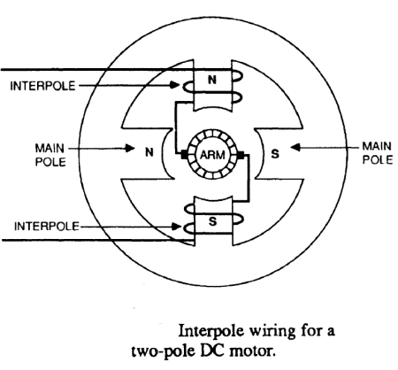
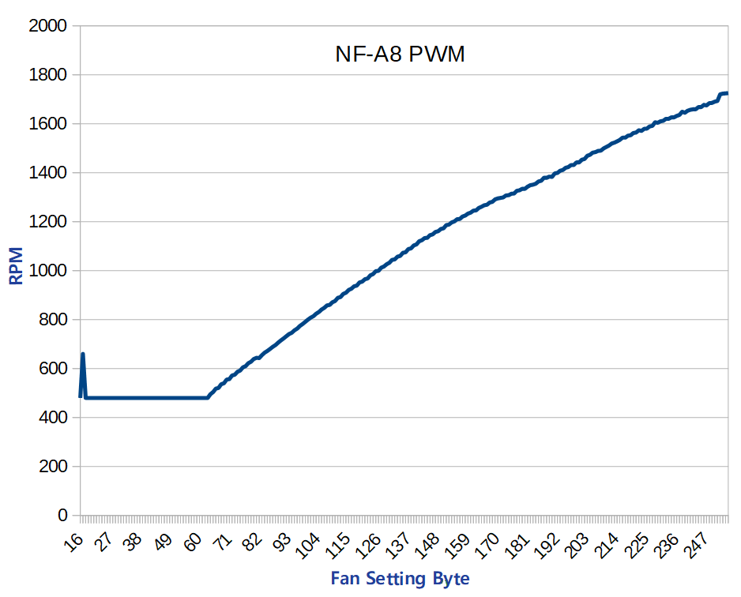
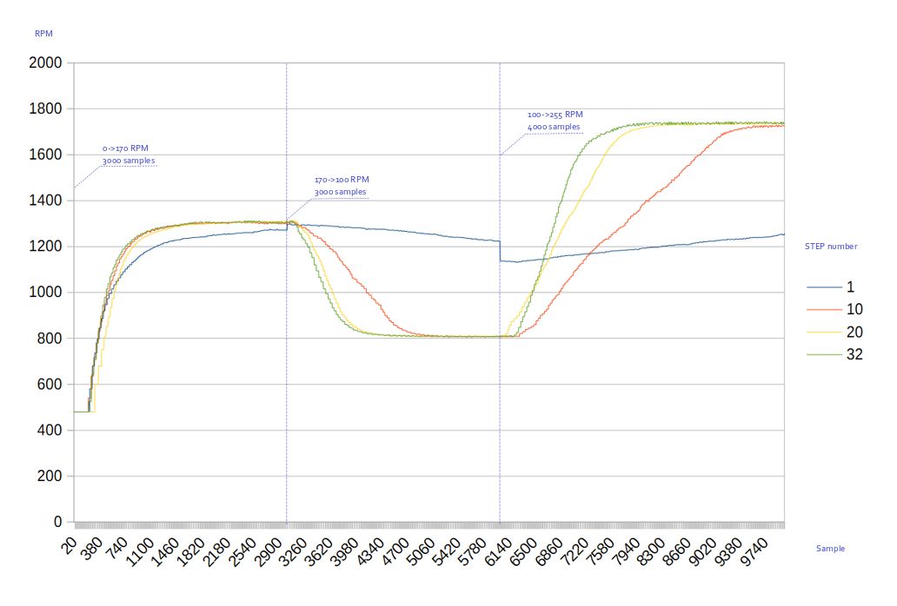
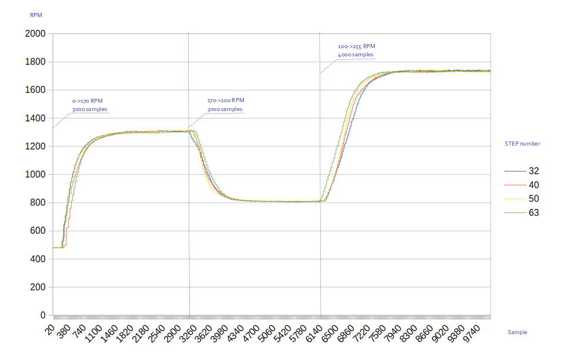

# emc2301_IIC python3 module

**Last modification:** 15.04.2021

### List of python files: ###

**Chip description**
The EMC2301 is an SMBus compliant fan controller with a  PWM  fan  driver.  The  fan  driver  is  controlled  by  a programmable  frequency  PWM  driver  and  Fan  Speed Control  algorithm  that  operates  in  either  a  closed  loop fashion  or  as  a  directly  PWM-controlled  device.

**emc2301_constant.py**

* Address & Bus variable
~~~python
I2CBUS             = 1         # /dev/i2c-1
EMC2301_ADDRESS    = 0x2F   # 8 bit version
~~~
* list of emc2301 chip registers and their statuses

**fan_type.py**

* file where are set parameters for manufacturers

**note:** currently only NF-8A PWM (Noctua), you can send me experiances from your test of other fan!  

**emc2301.py**

* EMC2301 - main chip class
* EMC2301.self_test - check chip connection
* EMC2301.read_register - read status of one register
* EMC2301.write_register - write new value to chip register
* EMC2301.speed - check fan speed calculated in RPM
* EMC2301.fan_kick_up - measure RPM samples after kick new speed value
  * call: fan_kick_up(offset,interval,sum_sample,new_value)
  * offset - time offset in sec before kick
  * interval - measure time between two samples in sec
  * sum_sample - number of samples
  * new_value - new RPM value
* EMC2301.productid - chip product id
* EMC2301.manufid - chip manufacture id
* EMC2301.revisionid - chip revisionid

function:
conf_register_list - list of all chip register (used in update register status)

### How to call python sub? ###


**example:**
```
3.7.3 (default, Dec 20 2019, 18:57:59) 
[GCC 8.3.0]
ecomet.emc2301: INFO     Start logging ...
:TEST_PASSED:
ecomet.emc2301: INFO     PRODUCT Read correct
ecomet.emc2301: INFO     PRODUCT ID: 37
ecomet.emc2301: INFO     MANUFACTURER Read correct
ecomet.emc2301: INFO     MANUF ID: 5D
ecomet.emc2301: INFO     REVISION Read correct
ecomet.emc2301: INFO     REVISION ID: 80
{'CONF': {'MASK': 'MASKED', 'DIS_TO': 'ENABLED', 'WD_EN': 'OPERATE', 'DR_EXT_CLK': 'CLK_OUTPUT', 'USE_EXT_CLK': 'EXTERNAL', 'EN_ALGO': 'DISABLED', 'RANGE': '1000>2', 'EDGES': '5>2POLE>1', 'UPDATE': '400ms', 'EN_RRC': 'ENABLED', 'GLITCH_EN': 'ENABLED', 'DER_OPT': 'BESIC_DERIVATE', 'ERR_RNG': '0RPM', 'GAIND': '4x', 'GAINI': '4x', 'GAINP': '4x'}, 'FAN_STAT': {'WATCH': 'EXPIRED', 'DRIVE_FAIL': 'MEET', 'DRIVE_FAIL_I': 'REACH', 'FAN_SPIN': 'SPIN', 'FAN_STALL': 'NOT_STALL', 'FAN_INT': 'NO_ALERT', 'FAN_SETTING': 100.0}, 'SPIN': {'DRIVE_FAIL_CNT': 'DISABLE', 'NOKICK': 'SPIN', 'SPIN_LVL': '60%', 'SPINUP_TIME': '500ms', 'FAN_MAX_STEP': 16, 'FAN_MIN_DRIVE': 40.0}, 'PWM': {'PWM_POLARITY': 'NORMAL', 'PWM_OUTPUT': 'OPEN-DRAIN', 'PWM_BASE': '26.00kHz', 'PWM_DIVIDE': 1}, 'TACH': {'TACH_COUNT': 8160, 'FAN_FAIL_BAND': 0, 'TACH_TARGET': 8191, 'TACH_READ': 2578}, 'ID': {'PRODUCT_ID': '37', 'MANUF_ID': '5D', 'REVISION_ID': '80'}}
---------------------------------
Speed: 0
1679
1629
1468
1238
974
673
480
...
```

**fan_type.py**

*library - parameters for RPM calculation (curently Noctua NF-8A Fan
*poles - number od poles
*edge - number od edge
*multiplier,range,edges - see id emc2301 spread sheet
*fan_tach - frequenci for tachometer monitoring (32.768kHz is internal frequency)


[1] https://images.app.goo.gl/A3zXdf1ZjpCWGGw17

see **emc2301_i2c_test.py** script

### Measure FAN RPM accuracy ###

For Fan managing is important to know accuracy of Chip speed setting and Fan RPM response. 

To measure FAN accuracy use script:
emc2301_i2c_speed_graph.py > fan.log
*produce file usable for excel:



### Measure kicking up new RPM value to fan ###

This represent dynamic parameters for fan management.

For changing spin_up time parameters we use these variables:
* FAN_SPIN_UP -> NOKICK (1)
* FAN_MAX_STEP (1-63) - slow - quick change of slope to reaching new value level

For testing use script emc2301_i2c_kick_up.py
sens.write_register(register = 'FAN_MAX_STEP', value = <#value>) will change slope for reaching new value

Here you see measured changed at the fan:
RPM was changed from 0->170->100->255 RPM and was measured 3000->3000->4000 samples after the kicking new RPM value




